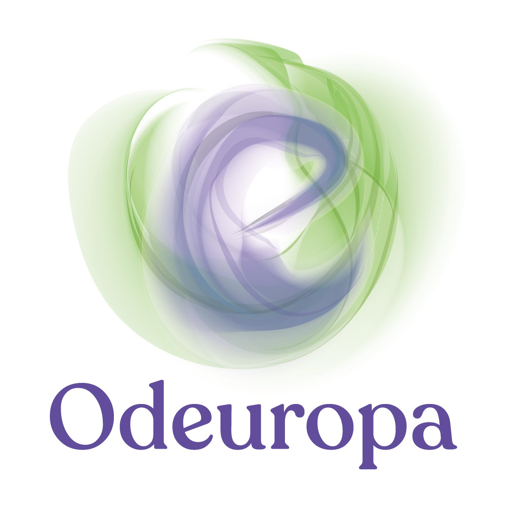

# Research Areas.

- [Semantic Web](http://wikipedia.org/wiki/Semantic_Web) & [Knowledge Graphs](https://towardsdatascience.com/knowledge-graph-bb78055a7884)
- [Knowledge Engineering](http://wikipedia.org/wiki/Knowledge_engineering) and [Knowledge Representation](http://wikipedia.org/wiki/Knowledge_representation_and_reasoning)
- [Information Extraction](http://ewikipedia.org/wiki/Information_extraction)
- [Recommender Systems](http://wikipedia.org/wiki/Recommender_system)

# Current Projects.

<section class="project" markdown="1">

**SILKNOW** FR EU H2020 (2018-2021)  
Semantic Web applied to Silk Cultural Heritage.  
I work on KG population and thesaurus realisation.

[SITE](https://silknow.eu/)
[DATA](https://data.silknow.org/)
[CODE](https://github.com/SILKNOW)
  
</section>

<section class="project" markdown="1">
**ANTRACT: Analyse transdisciplinaire des actualités filmées** FR ANR (2018-2021)    
I work on web-based face recognition strategies on historical videos.

[SITE](https://antract.hypotheses.org/1)

</section>

<section class="project" markdown="1">

**Odeuropa** EU H2020 (2021-2024)    
Preserve the European Olfactory Heritage.
I work on Knowledge Graphs, data modeling and knowledge inference.

[SITE](https://odeuropa.eu/)

</section>

# Past Projects.

<section class="project" markdown="1">

**DOREMUS: DOing REusable MUSical data.** FR ANR (2014-2018)  
Music data modeling, interconnection, exploration and recommendation.  
I contributed in realising the biggest dataset about classical music metadata.

[SITE](http://www.doremus.org)
[DATA](http://data.doremus.org)
[CODE](https://github.com/DOREMUS-ANR)

</section>

<section class="project" markdown="1">

**MeMAD: Methods for Managing Audiovisual Data** EU H2020 (2018-2021)    
I work on web-based face recognition strategies on TV videos.

[SITE](https://memad.eu/)
[DATA](https://data.memad.eu/)

</section>
# PhD Thesis.

**Knowledge-based music recommendation: Models, algorithms and exploratory search**  
[EURECOM](http://eurecom.fr) /
[Sorbonne University](https://www.sorbonne-universite.fr/) - Supervisor: [Raphaël Troncy](http://eurecom.fr/~troncy)  
*Defended on 11 October 2019*

[PDF](http://www.eurecom.fr/en/publication/6027/download/data-publi-6027.pdf)
[SLIDES](https://docs.google.com/presentation/d/1zR7lWs5e1uZJqZqWW8vcu6644gMGt2es24eFW-FMoCc/)

 

Representing information about music is a complex activity that involves different sub-tasks.
This thesis mostly focuses on classical music, researching how to represent and exploit rich metadata. Our main goal is to investigate knowledge representation and discovery strategies applied to classical music, including research topics such as Knowledge-Base population, metadata prediction and recommender systems.
  
We first propose a complete workflow for the management of music metadata using Semantic Web technologies. We introduce a [specialised ontology](http://data.doremus.org/ontology/) and a set of [controlled vocabularies](https://zenodo.org/record/1492441#.X8eT12RKhQJ) for the different concepts specific to music.
Then, we present an approach for converting data, in order to go beyond the librarian practice currently in use, relying on mapping rules and interlinking with controlled vocabularies.
Finally, we show how these data can be exploited. In particular, we study approaches based on embeddings computed on structured metadata, titles, and symbolic music for ranking and recommending music. Several [demo applications](https://github.com/DOREMUS-ANR) have been realised for testing the previous approaches and resources
